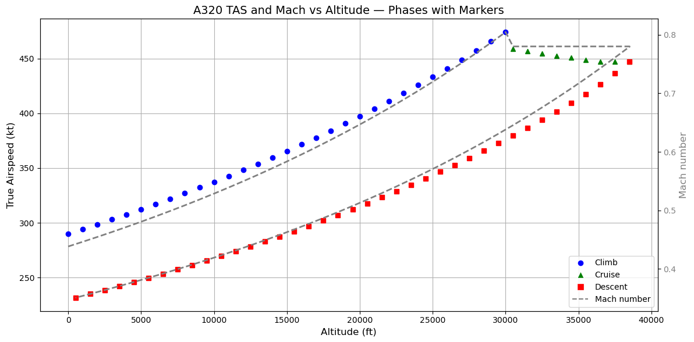

# ✈️ A320 True Airspeed vs Altitude — Flight Profile Simulation

This Python script simulates the true airspeed (TAS) of an Airbus A320 as a function of altitude, following a realistic commercial flight profile: climb, cruise, and descent. It uses atmospheric physics and aircraft performance logic to provide accurate results.

## 📊 Plot Overview

- **X-axis:** Altitude in feet (ft)  
- **Y-axis:** True Airspeed (TAS) in knots (kt)  
- **Secondary Y-axis:** Mach number (dimensionless)  
- **Markers indicate flight phase:**  
  - 🔵 Blue: climb  
  - ▲ Green: cruise  
  - ■ Red: descent  

## ✅ What the Script Does

### 1. Simulates Standard Atmosphere (ISA)

The script models the International Standard Atmosphere (ISA) to compute at each altitude:  
- Air density (ρ) in kg/m³  
- Speed of sound (a) in m/s  

This allows realistic conversion between indicated airspeed (IAS) and true airspeed (TAS).

### 2. Defines a Realistic A320 Flight Profile

| Phase   | Altitude Range     | Airspeed Reference | Notes                          |
|---------|--------------------|--------------------|--------------------------------|
| Climb   | 0 – 30,000 ft (FL300) | IAS = 290 kt       | Constant IAS; TAS increases with altitude |
| Cruise  | 30,000 – 39,000 ft | Mach = 0.78        | Constant Mach; TAS roughly constant  |
| Descent | 39,000 – 0 ft      | IAS = 280 kt       | Constant IAS; TAS decreases with altitude |

### 3. Converts IAS to TAS

To get the True Airspeed (TAS) at each altitude, the script uses the formula:

\[
\text{TAS} = \text{IAS} \times \sqrt{\frac{\rho_0}{\rho(h)}}
\]

Where:

- \(\rho_0\): sea-level air density (ISA) ≈ 1.225 kg/m³  
- \(\rho(h)\): air density at altitude  
- IAS and TAS are in knots (kt)  

### 4. Calculates Mach Number

The Mach number is calculated as:

\[
\text{Mach} = \frac{\text{TAS} \times 0.51444}{a}
\]

Where:

- TAS is in knots  
- 0.51444 converts knots to m/s  
- \(a\) is the speed of sound at altitude (in m/s)  

## 📐 Units and Abbreviations

| Term  | Meaning                   | Unit         |
|-------|---------------------------|--------------|
| ft    | Feet (altitude)           | [ft]         |
| kt    | Knot = 1 nautical mile/hour | [kt] ≈ 1.852 km/h |
| TAS   | True Airspeed             | [kt]         |
| IAS   | Indicated Airspeed        | [kt]         |
| Mach  | Airspeed / Speed of sound | [dimensionless] |
| ISA   | International Standard Atmosphere | N/A          |
| ρ     | Air density               | [kg/m³]      |
| a     | Speed of sound            | [m/s]        |

## 📈 Final Output

The output is a dual-axis plot:

- Left Y-axis: True Airspeed (TAS)  
- Right Y-axis: Mach number  
- Color-coded markers for each flight phase  

